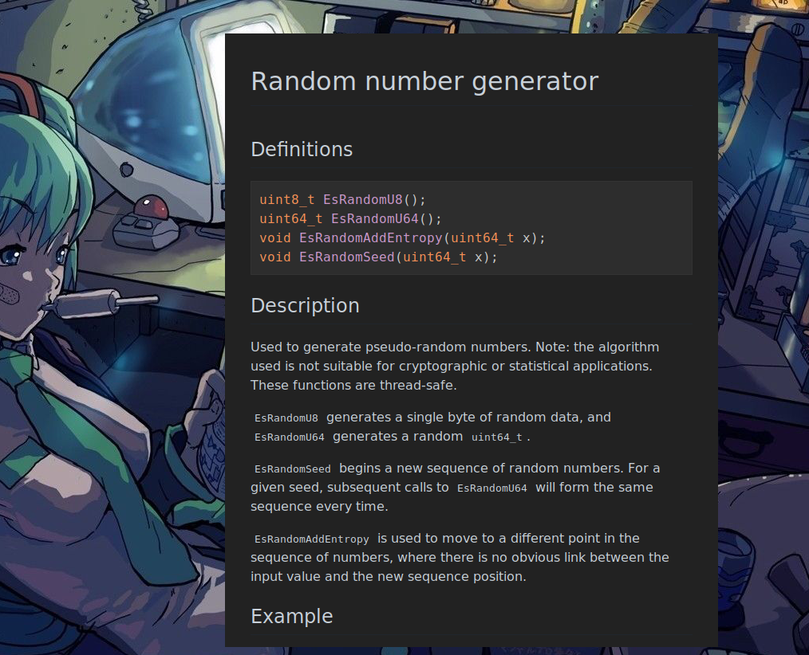

# LiteMDview

> A suckless markdown viewer.



## Table of contents

  * [Introduction](#introduction)
  * [Features](#features)
  * [Command line use](#command-line-use)
    * [Customization](#customization)
  * [Key bindings](#key-bindings)
    * [Navigation keys](#navigation-keys)
    * [Mouse keys](#using-mouse)
  * [Dependencies](#dependencies)
  * [How to install](#how-to-install)
  * [Todo](#todo)
  * [License](#license)

## Introduction

LiteMDview is a lightweight, extremely fast `markdown` viewer with lots of useful
features. One of them is ability to use your prefered text editor to edit markdown files, every time you save the file, `litemdview` reloads those changes (I call it live-reload). It has a convinient navigation through local directories, has support for a basic "git-like" folders hierarchy as well as `vimwiki` projects.

## Features

 - Does not use any of those bloated `gecko(servo)-blink` engines
 - Lightweight and fast
 - Live reload
 - Convinient key bindings
 - Supports text zooming
 - Supports images
 - Supports links
 - Navigation history
 - Cool name which associates with 1337, at least for me :)
 - Builtin `markdown` css themes
 - Supports emoji™️
 - `vimwiki` support
 - Basic html support (very simple offline documents in html)
 - Syntax highlighting

It is a full featured offline browser for a `markdown` websites and some basic html.

## Command Line Use

<pre>
Usage: litemdview file.md
    -p print html into stdout and exit
    -t <num> of theme to use
    -s <file> load external css
    -a print links into stdout
    -h show this information
    -v version
</pre>

For instance, if I want to convert a single file into `index.html` using second theme, I just do:

```
litemdview -t 2 -p REAMDE.md > index.html
```

## Customization

There is `-s style.css` option which makes `litemdview` use the stylesheet by default.
If you want to make a permanent changes, you should copy your custom stylesheet into `$HOME/.litemdview` file, and it will be loaded every time you launch `litemdview`. Please note that your default theme gets number `0` and zero theme moves to `3`.

To usea a specific theme by default, you can use an alias for your `sh`, for example:

`~/.zshrc`

```
alias litemdview='litemdview -t 2'
```

Vifm settings:

`~/.vifmrc`

<pre>
" Markdown
filetype *.md
      \ {View in litemdview}
      \ litemdview %f,
      \ {View in vim}
      \ vim %f
</pre>

## Key Bindings

  Key            |  Action 
-----------------|----------
  <kbd>q</kbd>   | Quit
  <kbd>?</kbd>   | Markdown cheatsheet
  <kbd>o</kbd>   | Open address bar
  <kbd>Esc</kbd> | Close address bar

## Navigation keys

  Key            |  Action
-----------------|----------
  <kbd>h</kbd>   | Go back in history
  <kbd>l</kbd>   | Go forward in history
  <kbd>j</kbd>,<kbd>ctrl+n</kbd> | Scroll down
  <kbd>k</kbd>,<kbd>ctrl+p</kbd> | Scroll up
  <kbd>ctrl+f</kbd> | Page down
  <kbd>ctrl+b</kbd> | Page up
  <kbd>g</kbd>    | Home
  <kbd>G</kbd>    | End
  <kbd>+</kbd>    | Zoom text in
  <kbd>-</kbd>    | Zoom text out
  <kbd>=</kbd>    | Reset zoom
  <kbd>0</kbd>    | Default theme
  <kbd>1</kbd>    | Light theme
  <kbd>2</kbd>    | Dark theme

## Using Mouse

The navigation through multiple `markdown` pages using links - involves
mouse. The click on <kbd>mouse button2</kbd> gets you back in web history and
<kbd>ctrl + mouse wheel</kbd> helps to change font size for the page.
In general, clicking works as usual.

## Dependencies

To successfully build the project you need to make sure you have a working `g++`
environment installed and configured. The `C++` version of `GTK` library
must be installed as well, it mainly consists of following list of packages:

 - gtkmm-3.0    gtkmm - C++ binding for the GTK+ toolkit
 - gdkmm-3.0    gdkmm - C++ binding for the GDK drawing kit

## How to install

Make sure all the dependencies are installed.

The build and installation process is simple:

```sh
./bootstrap
./configure
make
make install
```

## Todo

  * Keyboard navigation through links

## License

The `litemdview` uses a number of opensource components, such as:

  * `discount` - markdown parser
  * `litehtml` - html render

The `litemdview` itslef is published under [GPLv2 license](LICENSE):

<pre>
 This program is free software; you can redistribute it and/or
 modify it under the terms of the GNU General Public License
 as published by the Free Software Foundation; either version 2
 of the License, or (at your option) any later version.

 This program is distributed in the hope that it will be useful,
 but WITHOUT ANY WARRANTY; without even the implied warranty of
 MERCHANTABILITY or FITNESS FOR A PARTICULAR PURPOSE.  See the
 GNU General Public License for more details.
 Author: g0tsu
 Email:  g0tsu at dnmx.0rg
</pre>

repo:
https://codeberg.org/g0tsu/litemdview.git
